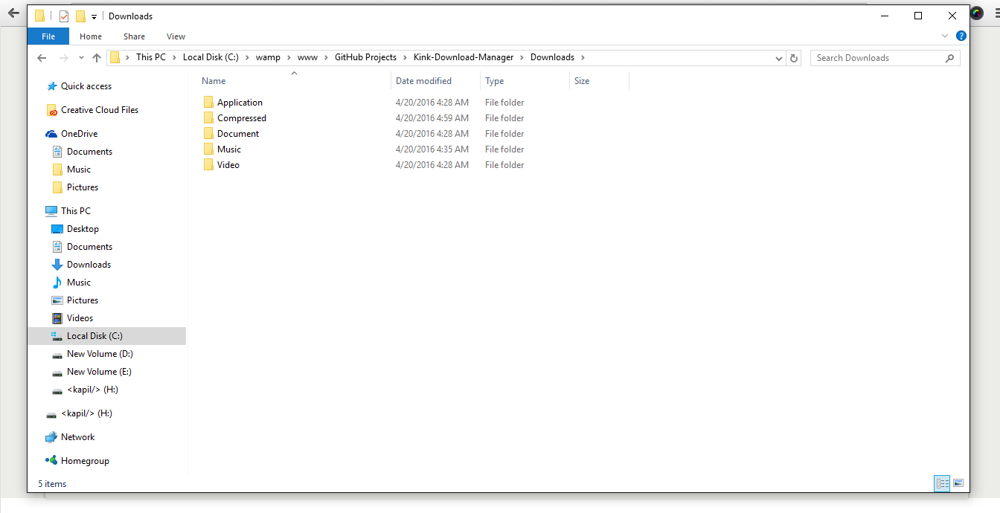
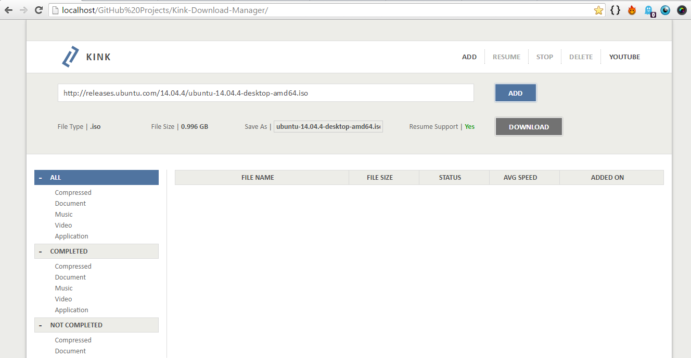
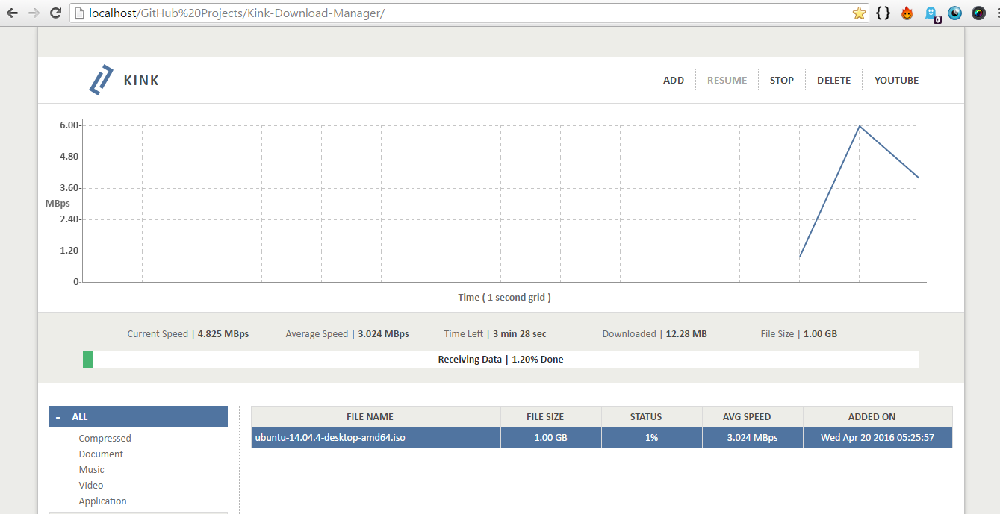
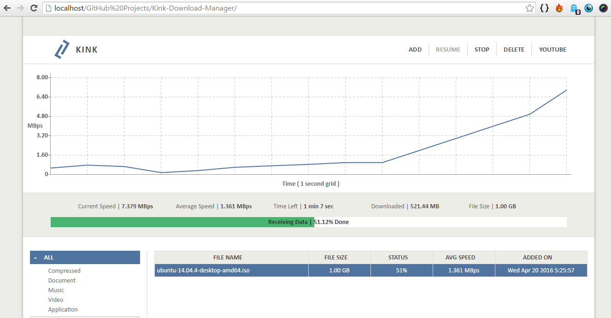
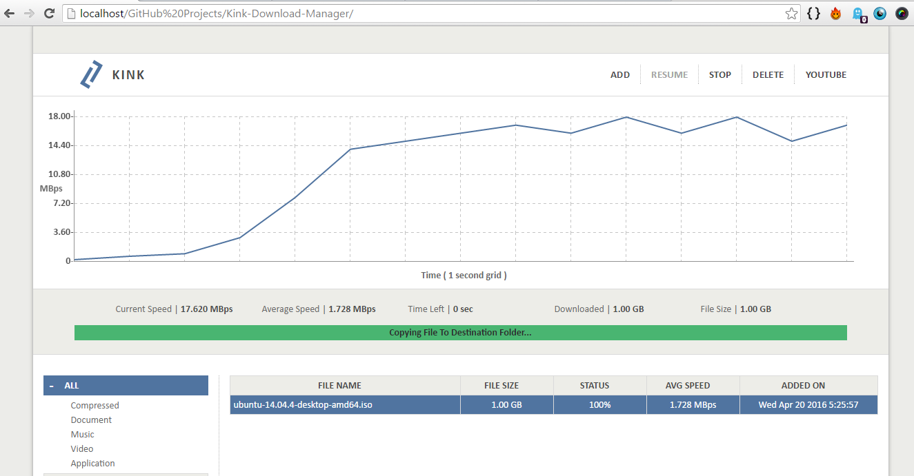
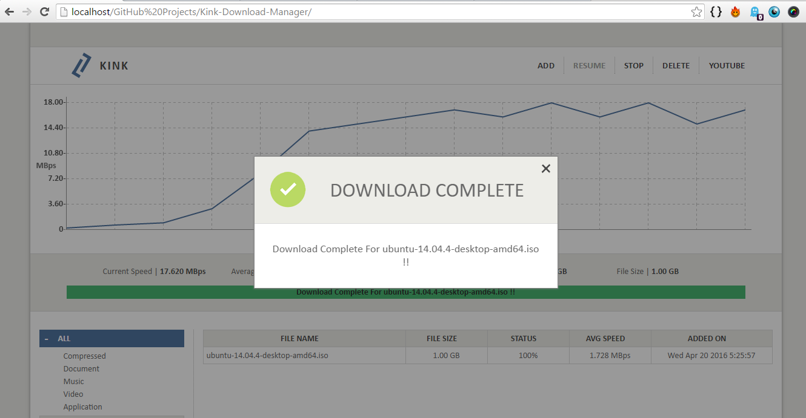
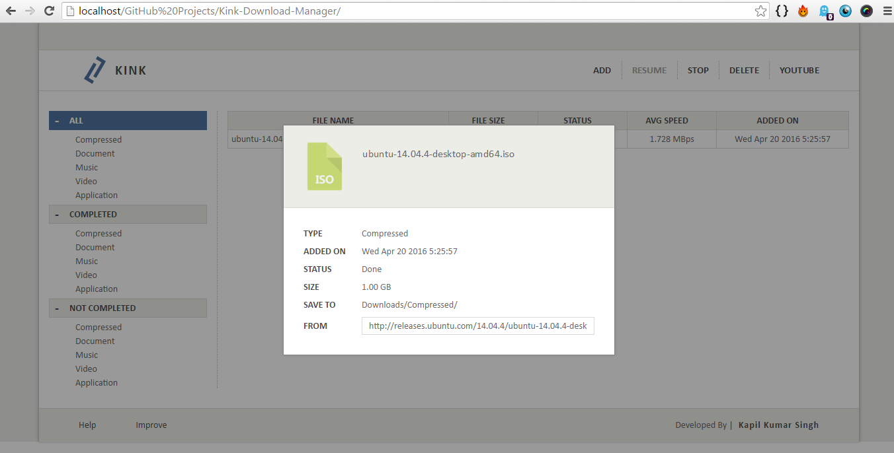
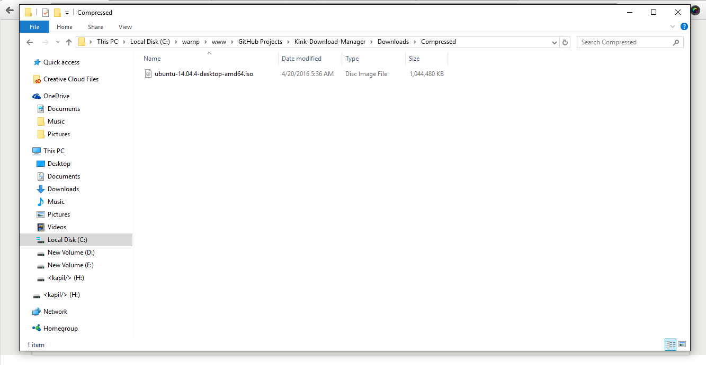

# Kink-Download-Manager
> Simple Download Manager based on PHP

## Requirements
* PHP
* cURL library
* MySQL
* Web server

## Installation
* Clone the repository
    ```
    git clone https://github.com/Kapilks/Kink-Download-Manager.git
    ```

* Check the permissions of the directory in which you cloned, to allow scripts to create files and directories.

* Modify authorization details in `Kink-Download-Manager/php/connection.php` to connect MySQL server.

* Start server and load home page<br/>
(When loaded first time it create all necessary directories and setup the database).


## Features
1. Support download of multiple files concurrently.
2. Segregate file into their respective type in following folders.

    

3. Allow download to be paused and resume later if the origin server supports it.<br/>
    This is checked by `Accept-Ranges` header in server response.
4. Real time graph of the current download speed.
    Drawn on HTML5 `<canvas>` element.

## Database schema
    Column name | Type
    ------------|------
    file_id | int(11)
    filename | varchar(255)
    url | varchar(2048)
    filesize | int(11)
    type | char(3)
    ext | varchar(15)
    complete | char(1)
    resume | char(1)
    avg_speed | varchar(20)
    last_try | timestamp
    added_on | timestamp
## Demo

These are screenshots of app while downloading **Ubuntu 14.04.4 LTS** (Tested on Windows 10)
   

1. ###### Adding download
    


2. ###### Download started
    


3. ###### 50% completed
   


4. ###### Copying file to destination folder
    


5. ###### 100% completed
    


6. ###### File properties
    


7. ###### File in `Compressed` folder
    
